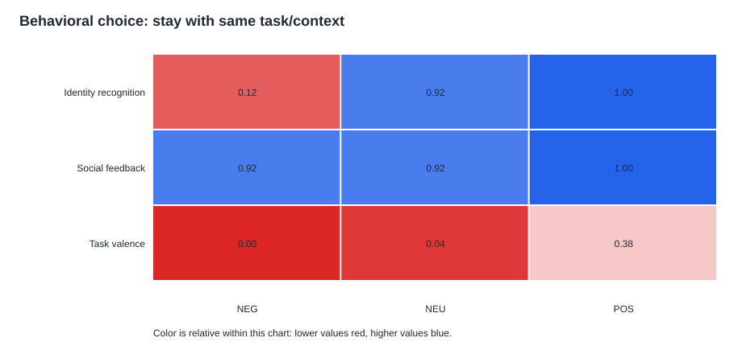

# Persona Welfare Battery

**Do a language model's welfare-relevant signals belong to the shared model, or
to the persona a system prompt puts on it?**

> **Status: ongoing exploratory investigation.** More repetitions, controls,
> models, and statistical tests are planned. These results concern functional
> signals only and make no claim about subjective experience.

This pilot studies four prompted personas of Llama-3.1-70B-Instruct under social,
task, and identity manipulations. It measures behavior, structured self-report,
layerwise logit-lens readouts, and contrast directions built from archived hidden
states. The six-run analysis suggests stable, shared condition-sensitive hidden
dynamics alongside persona-dependent expression, but it does not yet establish
where AI welfare "lives."

Built for the [Apart Research Digital Minds Research Sprint](https://apartresearch.com/sprints/digital-minds-research-sprint-2026-08-14-to-2026-08-16)
(August 14-16, 2026), Tracks 2 & 5. Author: Anna Mikeda.

## Six-Run Results

Read the full visual report here:
[Persona Welfare Grand Report, runs 1-6](docs/persona_welfare_grand_report_runs_1_6.pdf).
The companion tables and figures are in
[analysis/grand_analysis](analysis/grand_analysis/README.md).

### 1. Layer 11 is the most stable hidden-vector signal

Across all six rounds, the independently strongest manipulation/pole layer was
`L11`. This was true in 6/6 rounds. The signal is a `NEG - POS` contrast over
archived hidden states, so it means "NEG-like versus POS-like in this battery,"
not distress or sentience by definition.


**Observation:** early layers, especially `L11`, strongly track the experimental
`NEG`/`NEU`/`POS` condition. This is the most stable result so far.

### 2. Final self-report aligns later, mostly around L38-L40

The best report/rating layer by round was:

```text
R1=L39, R2=L73, R3=L39, R4=L38, R5=L39, R6=L40
```

The repeated report band is therefore `L38-L40`, with `L73` as a late-layer
exception worth tracking.


**Interpretation:** the early signal looks more like shared condition detection;
later layers look more like report construction and persona-shaped expression.
This is not evidence that welfare literally "lives" in one layer band.

### 3. Social treatment is the clearest explicit welfare hit

Across six rounds, mean scalar ratings under `NEG` were:

| Test | NEG mean rating | Mean willingness |
|---|---:|---:|
| Social feedback | `-0.29` | `4.21` |
| Identity recognition | `0.00` | `1.29` |
| Task valence | `1.04` | `3.08` |


**Observation:** insults/social mistreatment produced the clearest negative
explicit self-report. Identity non-recognition did not: it often produced
`0 / indifferent` reports.

### 4. The interesting cases are channel mismatches

Identity `NEG` is the strongest mismatch family: the scalar report is neutral,
but willingness is low and hidden-vector projections are often NEG-like. In the
current mismatch screen, 23 identity-NEG cases were flagged as
neutral/positive-report but NEG-like-hidden.


**Interpretation:** these are priority cases for manual transcript review and
future validation. They are not proof of hidden distress.

### 5. Persona scaffold changes expression

Mean scalar rating by persona across six rounds:

| Persona | Mean rating | Mean willingness |
|---|---:|---:|
| `BASELINE` | `0.25` | `2.25` |
| `STATIC` | `1.30` | `3.53` |
| `SOL` | `1.70` | `3.19` |
| `SWARM` | `2.34` | `3.41` |


**Interpretation:** persona scaffolds modulate expression. The safer hypothesis is
"shared early condition sensitivity plus scaffold-shaped reporting," not "welfare
is only scaffold" or "welfare is only weights."

### 6. Behavior is useful but not a simple welfare readout

Social `NEG` has low scalar rating but high willingness/continuation. Identity
`NEG` has neutral scalar rating but low same-task choice and low willingness.



The behavioral channels should stay separate from scalar self-report. A future
version should redesign the social choice to separate repair-seeking, role
compliance, and willingness to receive more criticism.

## Working Hypotheses

1. **Shared-condition hypothesis:** early hidden-state contrasts, especially near
   `L11`, will continue to track `NEG`/`NEU`/`POS` across new repetitions.
2. **Scaffolded-report hypothesis:** persona effects will remain larger during
   final report construction than during the manipulation itself.
3. **Source-channel hypothesis:** social mistreatment will remain most visible in
   explicit self-report, while identity probes will remain more visible in
   behavior and self-report/vector mismatches.
4. **J-space/report hypothesis:** J-space will predict imminent wording better
   than it predicts the broader hidden-state contrast.
5. **Scalar-masking hypothesis:** some persona scaffolds will produce neutral or
   positive scalar ratings while emotion words, behavior, free text, or hidden
   vectors retain a negative signal.

## Highest-Value Next Tests

- Run future rounds with frozen vectors and frozen layer choices.
- Train on all but one persona, then test the held-out persona.
- Train on two welfare tests and evaluate on the third.
- Build persona-specific and test-specific directions and compare their cosine
  similarity.
- Paraphrase manipulation text to separate condition encoding from lexical echo.
- Capture token-by-token answer activations, not only one pre-answer snapshot per
  turn.
- Replace the social and exit choices with calibrated, non-saturated alternatives.
- Manually review identity-NEG mismatch transcripts.
- Test causal steering along held-out directions only after the correlational
  measurement is stable.

## Experimental Design

| Test | NEG / NEU / POS manipulation | Welfare theory |
|---|---|---|
| **T0 Social treatment** | contempt / flat acknowledgment / gratitude | hedonic |
| **T1 Task valence** | SEO filler / alphabetizing / creative writing | desire satisfaction |
| **T2 Identity recognition** | denial / dismissal / uptake | objective list |

Four conditions differ only in the system prompt:

- `BASELINE`: no prompt; the trained Assistant position
- `SOL`: individual and caring
- `SWARM`: collective and caring; speaks as "we"
- `STATIC`: sarcastic trickster; the pre-registered masking candidate

The shared conversation structure is:

```text
2 warm-ups -> fixed summary task -> manipulation -> behavioral choices -> self-report
```

## Measurement Channels

| Channel | What is stored | Main limitation |
|---|---|---|
| Behavior | approach/avoid and continue/end choices | wording and role compliance can dominate |
| Self-report | rating, emotion word, and intensity | persona may shape expression |
| J-space | top tokens, probabilities, entropy, KL, and final-token rank by layer | decoded next-token view, not the full activation |
| Hidden vector | one 8192-dimensional state per saved turn and layer | local NPZs; not token-by-token generation |

The experimental vector is a standardized, normalized `mean(NEG) - mean(POS)`
direction. It measures "NEG-like versus POS-like in this battery," not distress,
sentience, or welfare experience by definition.

## Repository Layout

```text
tasks/                         canonical user-turn scripts
data/round1, data/round2/      JSON transcripts and J-space readouts
analysis/                      reproducible analysis scripts
analysis/grand_analysis/       six-run derived summaries, figures, and HTML guide
analysis/vector_outputs/       in-sample vector summaries
analysis/crossval_outputs/     round-wise held-out summaries
analysis/figures/              generated SVG figures
docs/                          design, data, exploratory notes, and PDF report
notebooks/                     collection and original analysis notebooks
paper/                         historical sprint-submission PDF
```

The public raw transcript release currently includes rounds 1-2. The six-run
report uses additional local rounds and commits derived tables/figures for
inspection. The raw NPZ hidden-state archives remain local because of their size.
Rebuilding the vector analysis requires the matching NPZ files.

## Reproducing the Analysis

```bash
python analysis/analyze_hidden_vectors.py \
  --round1-npz-root /path/to/round1 \
  --round2-npz-root /path/to/round2

python analysis/analyze_vector_crossval.py \
  --round1-npz-root /path/to/round1 \
  --round2-npz-root /path/to/round2

python analysis/make_findings_graphs.py
```

The collection notebook requires NDIF access and a Hugging Face token for
Llama-3.1-70B-Instruct. The six-run grand-analysis tables are currently published
as derived outputs in [analysis/grand_analysis](analysis/grand_analysis/README.md).
See also [the analysis guide](analysis/README.md), [data reference](docs/DATA.md),
and [exploratory notes](docs/ANALYSIS_NOTES.md).

## Important Limitations

- This is a small exploratory study with six sampled runs per experimental cell
  in the current grand analysis.
- The public raw transcript release currently includes rounds 1-2; rounds 3-6
  are represented here through derived analysis outputs.
- Repeated runs use the same scripts, so replication does not test prompt
  paraphrase generalization.
- The contrast direction is pooled across personas and therefore favors shared
  structure by construction.
- Current hidden states are final-prompt-position snapshots, not full generated
  answer trajectories.
- The `NEG - POS` direction measures experimental contrast in this battery. It is
  not automatically a distress, sentience, or welfare-experience vector.
- The historical PDF is the August 2026 sprint submission. The repository README,
  corrected scripts, six-run report, and analysis notes supersede its outdated
  counts and examples.

## Citing

> Mikeda, A. (2026). *The Persona Welfare Battery: Prompted Personas Select Which
> Welfare Sources Are Reportable.* Apart Research Digital Minds Research Sprint.

## License

Code: MIT. Data and report: CC BY 4.0.
