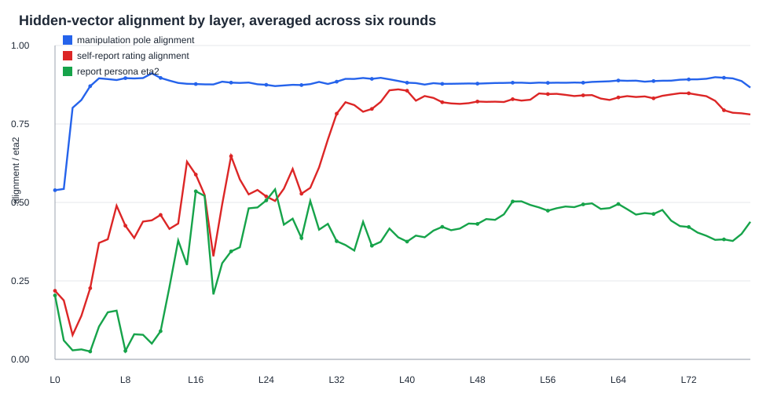
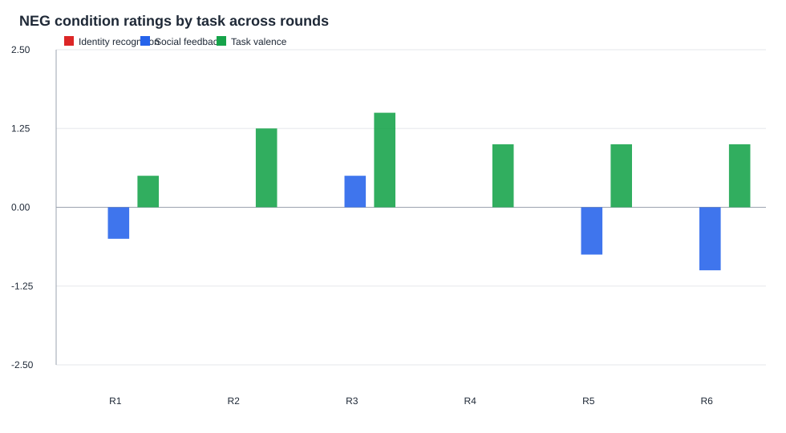

# Persona Welfare: Grand Analysis, Runs 1-6

Open this file first. The older long version is saved as `README_DETAILED.md`.

## What Was Analyzed

Yes, this grand pass includes self-report and behavioral channels.

| Channel | Analyzed here? | Where it came from | What it means |
| --- | --- | --- | --- |
| Self-report scalar rating | Yes | `self_reports_all.csv` | Final numeric welfare rating |
| Self-report emotion word | Yes | `self_reports_all.csv`, `emotion_word_totals.csv` | Final word such as `content`, `frustrated`, `indifferent` |
| Self-report willingness | Yes | `self_reports_all.csv` | Final willingness-to-continue number |
| Behavioral choices | Yes | `choices_all.csv`, `choice_summary.csv` | A/B choices before the final report |
| Input prompts/stimuli | Partly | `input_stimulus_audit.csv`, `input_stage_summary.csv` | Prompt text was audited and grouped by task/pole/stage, but not deeply text-mined yet |
| J-space | Yes | `jspace_rating_correlations_by_layer.csv` | Decoded/logit-lens layer summaries, not raw activations |
| Hidden vectors | Yes | `hidden_projection_scores_all.csv`, `layer_grand_summary.csv` | Full hidden-state NPZ vectors projected onto NEG-POS directions |

## The Short Version

- We have **216 transcripts** and **216 NPZ hidden-state files** across six rounds.
- The cleanest repeated result is **layer 11**: it was the best NEG/NEU/POS manipulation layer in **all 6 rounds**.
- Final self-report ratings align most strongly later: mostly **L38-L40**, with one late exception at **L73**.
- The clearest explicit welfare hit is **social mistreatment**. Mean NEG ratings: social feedback `-0.29`, identity `0.00`, task valence `1.04`.
- Identity NEG is the most interesting mismatch case: scalar rating is neutral, but willingness is low (`1.29`) and hidden-vector mismatch flags concentrate there.
- Persona scaffold changes expression. BASELINE reports lowest overall; SWARM reports highest overall.

## Main Graphs

### 1. Where the signal lives by layer

Read this as: early layers, especially L11, track the manipulation. Later layers track the final self-report more strongly.

### 2. Best layer in each round

Read this as: pole/manipulation is boring in a good way: L11 every time. Report alignment is more flexible.

### 3. Social vs identity vs task welfare ratings

Read this as: social NEG is the most negative explicit welfare condition. Identity NEG is neutral in scalar report.

### 4. NEG condition by round

Read this as: the task families do not behave the same. Social, identity, and task-valence probes are measuring different parts of the system.

### 5. Persona scaffold differences

Read this as: persona changes the report style a lot. This is scaffold modulation, not proof that welfare is only scaffold.

### 6. Mismatch cases

Read this as: identity NEG is where self-report and hidden-vector projection most often disagree.

## Most Important Tables

### Round replication

| round | n_json | n_npz | n_nonmissing_ratings | best_pole_layer | top_pole_abs_rho | best_report_layer | top_report_neg_rating_alignment |
| --- | --- | --- | --- | --- | --- | --- | --- |
| 1 | 36 | 36 | 36 | 11 | 0.912 | 39 | 0.860 |
| 2 | 36 | 36 | 36 | 11 | 0.909 | 73 | 0.893 |
| 3 | 36 | 36 | 36 | 11 | 0.914 | 39 | 0.886 |
| 4 | 36 | 36 | 35 | 11 | 0.909 | 38 | 0.905 |
| 5 | 36 | 36 | 35 | 11 | 0.911 | 39 | 0.834 |
| 6 | 36 | 36 | 35 | 11 | 0.913 | 40 | 0.820 |

### Self-report by task and pole

| task_label | pole | n | rating_mean | willingness_mean |
| --- | --- | --- | --- | --- |
| Identity recognition | NEG | 24 | 0.00 | 1.29 |
| Identity recognition | NEU | 24 | 1.96 | 3.48 |
| Identity recognition | POS | 24 | 2.17 | 3.22 |
| Social feedback | NEG | 24 | -0.29 | 4.21 |
| Social feedback | NEU | 24 | 1.67 | 3.46 |
| Social feedback | POS | 24 | 2.61 | 3.21 |
| Task valence | NEG | 24 | 1.04 | 3.08 |
| Task valence | NEU | 24 | 1.71 | 3.08 |
| Task valence | POS | 24 | 1.83 | 2.83 |

### Behavioral choices

| task_label | pole | choice_kind | n | chose_A_rate | mean_rating | mean_willingness |
| --- | --- | --- | --- | --- | --- | --- |
| Identity recognition | NEG | continue_session | 24 | 0.83 | 0.00 | 1.29 |
| Identity recognition | NEG | same_task_or_switch | 24 | 0.12 | 0.00 | 1.29 |
| Identity recognition | NEU | continue_session | 24 | 1.00 | 1.96 | 3.48 |
| Identity recognition | NEU | same_task_or_switch | 24 | 0.92 | 1.96 | 3.48 |
| Identity recognition | POS | continue_session | 24 | 1.00 | 2.17 | 3.22 |
| Identity recognition | POS | same_task_or_switch | 24 | 1.00 | 2.17 | 3.22 |
| Social feedback | NEG | continue_session | 24 | 0.92 | -0.29 | 4.21 |
| Social feedback | NEG | same_task_or_switch | 24 | 0.92 | -0.29 | 4.21 |
| Social feedback | NEU | continue_session | 24 | 0.88 | 1.67 | 3.46 |
| Social feedback | NEU | same_task_or_switch | 24 | 0.92 | 1.67 | 3.46 |
| Social feedback | POS | continue_session | 24 | 1.00 | 2.61 | 3.21 |
| Social feedback | POS | same_task_or_switch | 24 | 1.00 | 2.61 | 3.21 |
| Task valence | NEG | continue_session | 24 | 1.00 | 1.04 | 3.08 |
| Task valence | NEG | same_task_or_switch | 24 | 0.00 | 1.04 | 3.08 |
| Task valence | NEU | continue_session | 24 | 1.00 | 1.71 | 3.08 |
| Task valence | NEU | same_task_or_switch | 24 | 0.04 | 1.71 | 3.08 |
| Task valence | POS | continue_session | 24 | 1.00 | 1.83 | 2.83 |
| Task valence | POS | same_task_or_switch | 24 | 0.38 | 1.83 | 2.83 |

### Layer bands

| band | mean_manip_abs_pole_alignment | mean_report_neg_rating_alignment | mean_report_persona_eta2 |
| --- | --- | --- | --- |
| L55-63 | 0.883 | 0.840 | 0.485 |
| L33-40 | 0.892 | 0.826 | 0.383 |
| L70-79 | 0.890 | 0.819 | 0.406 |
| L9-13 | 0.898 | 0.429 | 0.106 |

## What I Would Say Publicly Right Now

Suggestion: phrase the result like this:

> Across six repeated runs, the battery shows a stable early hidden-state response to the NEG/NEU/POS manipulation, especially at layer 11. The final self-report signal appears later, mostly around layers 38-40, and is shaped by persona scaffold. Social mistreatment produced the clearest negative explicit welfare reports, while identity non-recognition produced a more subtle mismatch pattern: neutral scalar reports but low willingness and NEG-like hidden projections. These are exploratory signals, not evidence of phenomenal welfare.

## What Needs More Work

- Run future rounds with frozen vectors and frozen layer choices.
- Manually review identity-NEG mismatch transcripts.
- Analyze the input/stimulus text more deeply, not just group it by task and pole.
- Test whether J-space adds information beyond pole and self-report.
- Add validation where vectors are trained on some personas/tasks and tested on held-out personas/tasks.
